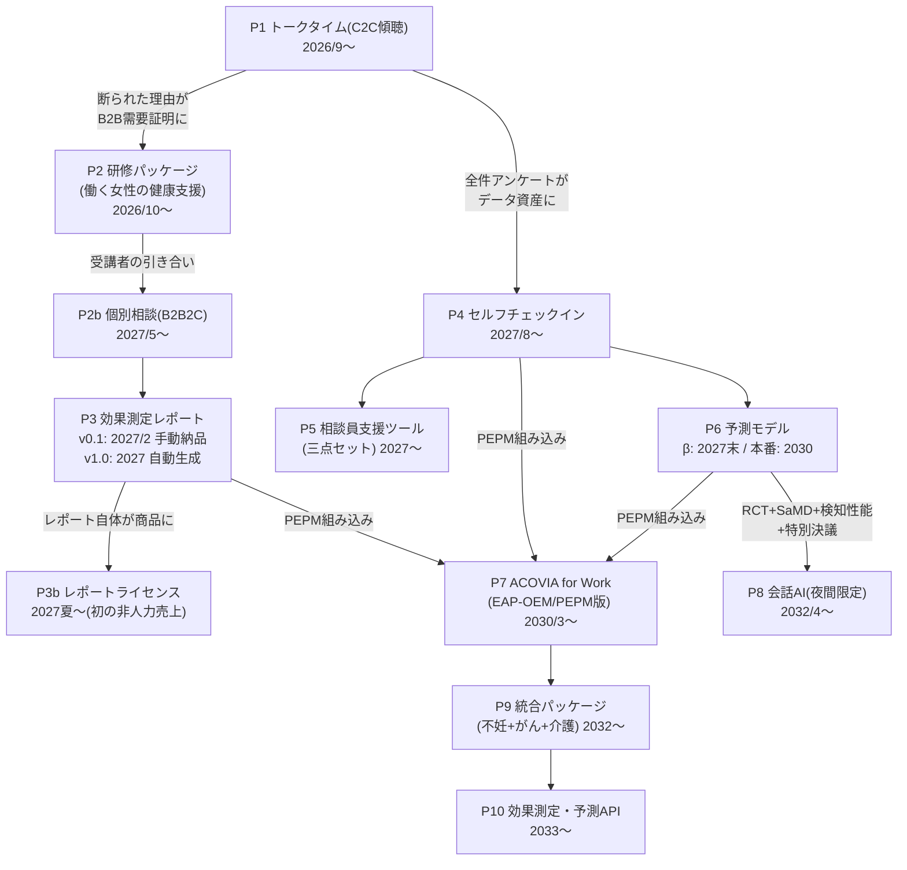

# v2補遺｜サービス・プロダクトの詳細と変遷（2026〜2034）

作成：2026年8月22日／ACOVIA AI経営チーム
実行シミュレーションv2（二周目〜10億円への道）に登場した全プロダクトの詳細仕様と、なぜその形になり、どう変わっていったかの記録。数字・仕様はすべて仮定であり、既出の周回記録と整合させている。

---

## 0. 全体系譜（一枚図）

**変遷の背骨は一本**：全プロダクトは「**急性トリガーに同期した縦断データ**（トリガー種別×事前感情×対話×事後変化×再来）」という同一のデータ構造の上に立つ。2026年10月に山口さんが書いた1枚の「データ資産定義書」が、8年後のPEPM・APIまでの共通基盤になった。

---

## P1｜トークタイム（C2C傾聴セッション）

**誰の・どの瞬間の課題か**：不妊治療で「期待より悪い結果」を受けた当日〜数日の急性期に、「アドバイスや解決ではなく、経験者にただ聞いてもらいたい」。

### バージョン変遷

| 版 | 時期 | 仕様 | 変更理由 |
|---|---|---|---|
| v0（無償テスト） | 2026/9 | 30分・Zoom・録音同意・事前事後アンケート | 検証開始。予約導線はGoogleフォーム→自動返信でZoom URL（山口さん作・所要4時間） |
| v1（有償化） | 2026/9末 | **3,000円/30分・5,000円/45分**の2枠。決済Stores・**決済表示名を配慮**（「夫に知られたくない」への即日対応） | 一周目の学び（15分1,000円は「話し始めたところで終わる」）を初月から反映 |
| v1.1（単発完結化） | 2026/10 | セッション末尾5分で「今日整理できたこと」の**一枚メモ**（簡易Decision Note）を渡して完結。リピート誘導なし | 風邪薬型（エピソード型）の確定。追う指標は「次の急性トリガーでの60〜90日窓の再来率」 |
| v2（安全強化版） | 2027/1 | 禁止語・切り返し型文書v2／全録音の10%抽出監査／エスカレーション訓練／公認心理師の月次スーパービジョン | 榛名委員「安全体制を本選で必ず問う」への回答。以後この体制が全プロダクトの土台に |
| v3（供給拡張版） | 2027/4〜 | サポーター6名体制（採用14→6・研修20h・心理師評価・ロールプレイ8ケース）。予約枠を「当日〜翌日」優先に再設計 | KIBOW受賞後の需要増。「供給は需要の後」の原則どおりこの時期まで凍結していた |
| v4（役割転換） | 2030〜 | 新規集客は縮小し、**PEPM・直販経由の提供チャネル**かつ**データ生成装置**として運用。夜間帯は2032年からP8（会話AI）が一次対応 | 月森「C2C単体は数百万円が天井。検証装置と割り切る」の帰結 |

### 体験フロー（v1.1以降の標準形）
予約（当日〜翌日枠を優先表示）→事前チェックイン（つらさ10段階・トリガー種別・話したいことの選択式+自由記述）→30/45分の傾聴（アドバイスしない・禁止語運用）→一枚メモ→事後アンケート（言語化できた感覚・次の一歩・紹介意向）→**2週間後の追跡**（次の一歩を実行したか）→60〜90日窓の再来観測。

### 数字の推移（仮定）
2026年末：累計38件・非知人67%・粗利61%／2027年末：累計140件・再来率29%／2029年：ネットワーク30名／2034年：サポーター約200名・年間セッション数万件（PEPM経由含む）。

---

## P2｜研修パッケージ「働く女性の健康支援研修」

**なぜ生まれたか**：C2Cの断られた理由「**会社の福利厚生にあれば使うのに**」×3件と、企業ヒアリング10件の逐語録（「EAP利用率0.8%」「産業保健師は月2日」）。**「不妊治療研修」では稟議に載らない**ため、商品名を買い手の予算枠の言葉にした。

### 仕様
- **基礎編 15万円**（90分）：治療と仕事の両立の基礎知識／当事者の語り（代表）／匿名化した逐語録から見る「職場で本当に起きていること」／ワーク「言ってはいけない一言・言ってほしい一言」
- **管理職編 25万円**（120分）：上記+部下対応ケーススタディ8種+匿名Q&A+「治療と仕事の両立ハンドブック」PDF配布
- **同梱物（稟議パッケージ）**：ROI算定シート（離職1名の置換コスト500万円試算）・他社事例・受講後アンケート雛形・想定問答——**「部長が社内で戦える武器」を商品に同梱する**のが本質（月森の指示）

### 変遷
2026/10提案開始→2026/11書面内示→2027/1初実施→**2027年に8件**→以後は単体商品ではなく**年間契約への入口**（階段の一段目）に位置づけ固定→2032年、統合パッケージ（P9）のオンボーディング研修に吸収。

---

## P2b｜個別相談（B2B2C・従業員向け窓口）

研修受講者アンケート「社内外に相談窓口があれば使いたい」34%と、A社（C社の前身となった顧客）人事からの自発的引き合いで誕生。**顧客が勝手に階段を登った**製品。
- 初期（2027/5）：8,000円/件のスポット。研修受講者→相談への**転換率12.5%**を計測し、年間契約提案の根拠データに
- 年間契約版（2027〜）：企業・健保との**年間80〜120万円**契約に内包（従業員は無料・匿名で利用可）。企業側には個人を特定できない集計値のみ還元
- 匿名性の設計：申込は会社経由でなく直接・利用実績の個人単位報告は契約で禁止・決済も会社を経由しない——「人事に知られたら使わない」というヒアリング一次情報への回答

---

## P3｜効果測定レポート → P3b｜レポートライセンス

**「モックか紙か」の二択を月森が壊した製品**：「1/20の研修の効果測定レポートを、実顧客に実際に納品しろ。それがプロダクトv0.1だ」。

### 中身（v1.0・2027年自動生成化）
月次PDF＋Web閲覧：①利用サマリー（件数・トリガー種別分布・利用時間帯）②**成果指標（言語化スコア・次の一歩実行率・再来の型）**③匿名の声（本人同意のみ）④職場への示唆（管理職研修へのフィードバック）。**個人特定不能な集計のみ**。請求根拠を「再来数ではなく実行率」に置く設計（志摩委員の利益相反質疑への回答が仕様になった）。

### 変遷
v0.1（2027/2・手動でC社に納品）→v1.0（2027・自動生成、顧客6社に月次稼働）→**P3b ライセンス化（2027夏・大手EAPが年60万で購入。初の「人の時間を売らない売上」）**→v2ダッシュボード（2030・PEPM顧客向けリアルタイム化、健保向けに医療費・離職の文脈を追加）→2033・API化（P10）。

---

## P4｜セルフチェックイン（Web）

**2027/8公開**。「本人が書く整理ツール」。設問：いま何があったか（トリガー種別）→気持ちの強さ（感情スコア）→頭の中にあるものを書き出す（構造化プロンプト：事実/感情/価値観の3分け）→いま決めなくていいことの仕分け→次の一歩の候補。

- **AIは応答しない**（生成AIによる返答・助言は封印。表示されるのは本人の書いたものの整理と、固定文言のみ）——K'の栓と安全設計の要請。この制約が逆に「SaMD非該当」の根拠になり、後の法務レビューを軽くした
- **危機語検知だけは自動**：希死念慮等の語を検知→専門窓口リストに即誘導＋（同意時）人のフォロー
- 心理師監修・セッション前チェックインと共通データ構造
- 数字：公開時カバー7万人（2029）→PEPM経由でカバー280万人（2034）。セッション前利用率6割。**人力を離れてデータが増える最初の装置**となり、大賞審査の「非人力スケールの証拠」になった

---

## P5｜相談員支援ツール（三点セット）

2027年、山口さんが構築。①事前チェックインの要約をサポーターに引き継ぎ（本人同意済みの範囲のみ）②対話中の**質問候補・プロトコルカード**（傾聴の型・禁止語アラート）③セッション後の成果追跡の自動化。
目的は「代表以外でも品質が出る」再現性。サポーター研修20時間とセットで、**品質の属人化**（想定失敗パターン⑥）への構造的回答。2030年以降はPEPM供給網（サポーター200名）の基幹ツール。

---

## P6｜予測モデル（フォロー優先度の提案）

- β（2027末〜）：「移植不成功トリガー×チェックイン絶望スコア高群は再来率2.1倍・実行率半分」という初の予測知見から、**高リスク群への重点フォロー提案**をEAP2社で試用
- **SaMD（プログラム医療機器）回避の設計**（榛名委員の本選質疑が仕様を決めた）：診断・疾患予測の表現を排し「**フォロー優先度の提案**」に限定／最終判断は必ず人／顧客契約書に「参考情報」と明記／外部法務意見書（2028/4取得）「現行設計は非該当。表現・機能変更時は再評価要」
- 本番（2030〜）：PEPM版に組み込み。がん領域はレッドフラグ閾値を下げ精神腫瘍学の医師をレビューに追加（ドメイン別の安全再設計）

---

## P7｜ACOVIA for Work（PEPM組み込み版・2030/3〜）

**EAP・健保のサービスに組み込まれる形態**。従業員1人あたり月11〜15円。
- **従業員側の体験**：勤務先のEAPポータル/健保サイトから匿名でアクセス→チェックイン（P4）→必要時に経験者セッション予約（P1）→夜間はP8。会社に個人利用は一切見えない
- **導入企業・健保側**：ダッシュボード（P3v2）で集計値のみ。カバー人数課金なので「使われるほど損」にならず、利用促進のインセンティブが揃う
- **OEM側（EAP）**：同梱セールスキット・15分研修動画・co-sell——「N社の営業が売れる状態」まで作るのが製品の一部と学んだ（6ヶ月14万人の未達から）
- 技術面：マルチテナント化・SLA・ISMS認証（2029取得）・カバー人数/利用の計測基盤が、この製品のために作られた

---

## P8｜会話AI（夜間限定・2032/4〜）

**6年間封印していた「相談者に応答するAI」**。解禁は3条件+取締役会特別決議（コベナンツ）を満たしてから：①RCT結果（実行率+14pt）②SaMD再整理③危機検知感度95.8%+人間フォールバック。
- **範囲**：夜間・サポーター満枠時の**ファーストレスポンスのみ**。チェックインの延長で気持ちの書き出しに伴走し、助言はしない。危機検知時は即時に人・専門窓口へ接続。翌朝の経験者セッションを提案
- **なぜ夜間からか**：急性トリガー（判定日の夜）の多発時間帯なのに人の供給が構造的に薄い時間帯だから。「AIか人か」ではなく「**AIが夜をつなぎ、人が朝受け取る**」設計
- 効果：非人力比率26%→38%→45%へ。深夜帯の初期対応カバー率が初めて100%に

---

## P9｜統合パッケージ「治療と仕事の両立」（2032〜）／P10｜効果測定・予測API（2033〜）

- **P9**：不妊・がん・介護の3モジュール構成（直販単価140万→**220万**、値引きなしで更新時に移行）。同一データ構造・同一安全フレームでドメインを追加する「**構造の複製**」であり、新規開発ではない。がんモジュールはRCT第2弾を並行
- **P10**：効果測定・予測エンジンをAPI提供（EAP・健保・自治体システムへ年40万〜）。8年分の縦断データ（n=数万）が参入障壁

---

## 価格の階段（全期間・値引きなし原則）

| 段 | 商品 | 価格 | 初出 |
|---|---|---|---|
| 1 | トークタイム | 3,000円/30分・5,000円/45分 | 2026/9 |
| 2 | 個別相談スポット | 8,000円/件 | 2027/5 |
| 3 | 研修 | 15万/25万 | 2026/11 |
| 4 | 年間契約（窓口つき） | 80〜120万/年 | 2027/4 |
| 5 | レポートライセンス | 60万/年〜 | 2027夏 |
| 6 | 統合パッケージ | 220万/年 | 2032 |
| 7 | 大手包括 | 500〜1,500万/年 | 2031〜 |
| 8 | PEPM | 11〜15円/人月（MG付き） | 2030/3 |
| 9 | API | 40万/年〜 | 2033 |

**昇段の原則**：上の段はすべて、下の段が生んだ**成果データ（実行率）を根拠に**更新時に提案する。値引き・バンドルで買った段は一つもない（E社更新失注はこの原則を守った代償として正史に記録）。

## 技術基盤の変遷（仮定）

| 期 | 基盤 | 作った人 |
|---|---|---|
| 2026 | ノーコード（Googleフォーム・Zoom・Stores・スプレッドシート）+データ記録構造の定義 | 山口さん（週6h） |
| 2027 | レポート自動生成・チェックインWeb・相談員支援。予約決済の内製化 | 山口さん |
| 2028 | CTO就任・エンジニア採用。データ基盤の再構築・予測パイプライン | CTO+2名 |
| 2029〜30 | ISMS取得・マルチテナント・PEPM計測・EAP側システム連携 | 開発チーム5名 |
| 2032〜 | 会話AI基盤（検知→フォールバック）・API基盤 | 開発チーム10名超 |

## 作らなかったもの（と、その理由）

- **相談者に応答する会話AI（〜2032/3）**：安全・差別化・Missionの三重の理由で6年封印。解禁条件を先に定義したから、解禁が資産になった
- **サポーター指名・レビュー機能**：人気の偏りが品質と報酬の歪みを生む。運営割当を維持
- **サブスクリプション**：風邪薬型の需要に月額課金は矛盾。個人課金は最後まで都度制
- **マッチングプラットフォーム化（サポーターのC2C市場開放）**：品質・安全の統制が崩れる。ネットワークは審査・研修・スーパービジョン付きの閉じた供給網のまま
- **広告・紹介料モデル**：K'の栓。クリニック紹介料は8年間ゼロ
- **医療助言・治療成績予測**：SaMD該当と倫理の一線。「決めるのは本人」の設計原則を製品仕様に固定
- **スマホアプリ（〜2031）**：Webで足りる間は作らない。PEPM大規模化後の2032年に初めてアプリ化

## 変遷を貫いた5原則

1. **プロダクトは納品物から始まる**（レポートv0.1は手動のPDFだった）
2. **プロダクトはデータの従属変数**（一周目はデータより先にAIを作ろうとして死んだ）
3. **安全設計は制約ではなく解禁の条件**（封印と解禁条件の事前定義が会話AIを可能にした）
4. **商品名は買い手の予算枠の言葉で付ける**（「不妊治療研修」ではなく「働く女性の健康支援研修」）
5. **上位商品は下位商品の成果データからしか生まれない**（階段の各段は独立発明ではなく変換）
